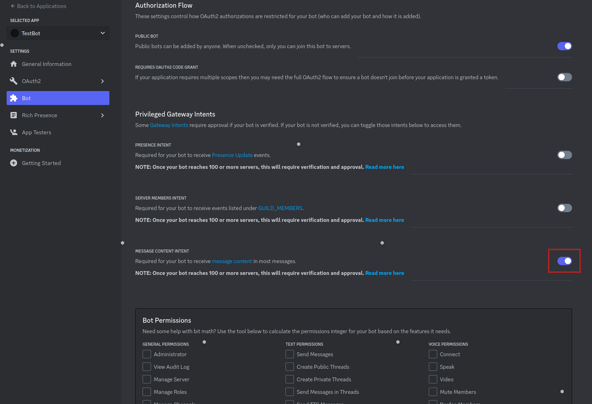
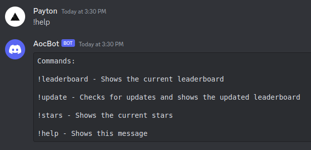
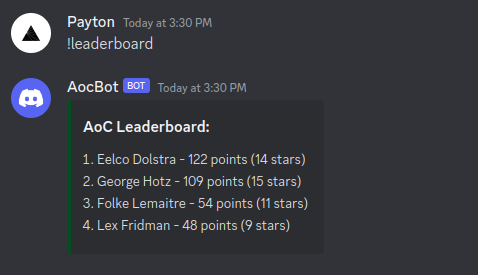
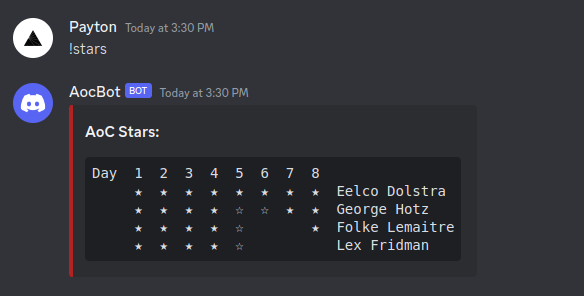

<a name="readme-top"></a>

<h3 align="center">AocDiscordBot</h3>

  <p align="center">
  A Discord bot designed to monitor a private Advent of Code (AoC) leaderboard. It automatically fetches and checks for updates, then notifies members when someone on the leaderboard earns a new star, or when a new member has joined.
  </p>
</div>


<!-- TABLE OF CONTENTS -->
<details>
  <summary>Table of Contents</summary>
  <ol>
    <li><a href="#about-the-project">About The Project</a></li>
    <li>
      <a href="#getting-started">Getting Started</a>
      <ul>
        <li><a href="#installation">Installation</a></li>
      </ul>
    </li>
    <li><a href="#usage">Usage</a></li>
  </ol>
</details>


<!-- ABOUT THE PROJECT -->
## About The Project

The AocDiscordBot is a specialized Discord bot designed to enhance the experience of participating in the Advent of Code (AoC) challenges among a private group. Advent of Code is an annual series of programming puzzles that span a variety of skill sets and challenge types. The bot is designed for small, personal servers and can easily be self-hosted. I am currently running this bot on my Raspberry Pi 4.

Key Features:

* Automated Updates: The bot automatically fetches the latest stars and scores from the Advent of Code leaderboard.

* Real-Time Notifications: Members are notified in Discord when someone on the leaderboard earns a new star, keeping everyone up-to-date and engaged.

<p align="right">(<a href="#readme-top">back to top</a>)</p>


<!-- GETTING STARTED -->
## Getting Started

To add this bot to your own server, follow these steps.

### Prerequisites

You need to create your own Discord app through their [Devloper Portal](https://discord.com/developers/docs/intro)

Make sure to enable **MESSAGE CONTENT INTENT** for the bot:



### Installation

1. Clone the repo

   ```sh
   git clone https://github.com/PaytonWebber/AocDiscordBot.git
   ```

2. Create a .env file at the root of the repo

   ```sh
   touch .env
   ```

3. Enter the following information in the .env file you just created

   ```ini
   SESSION_COOKIE="<YOUR COOKIE>"
   LEADERBOARD_ID="<YOUR LEADERBOARD ID>"
   DISCORD_TOKEN="<YOUR BOT's TOKEN>"
   CHANNEL_ID="<THE CHANNEL YOU WANT THE BOT TO MONITOR>"
   ```

4. Build the project

   ```sh
   make
   ```

5. Start the bot

   ```sh
   ./bot
   ```

<p align="right">(<a href="#readme-top">back to top</a>)</p>


<!-- USAGE EXAMPLES -->
## Usage

The bot is mostly autonomous, but can be interacted with using the following commands:







<p align="right">(<a href="#readme-top">back to top</a>)</p>

## License

[MIT](LICENSE)

<p align="right">(<a href="#readme-top">back to top</a>)</p>
